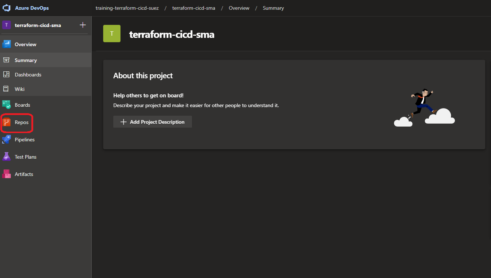
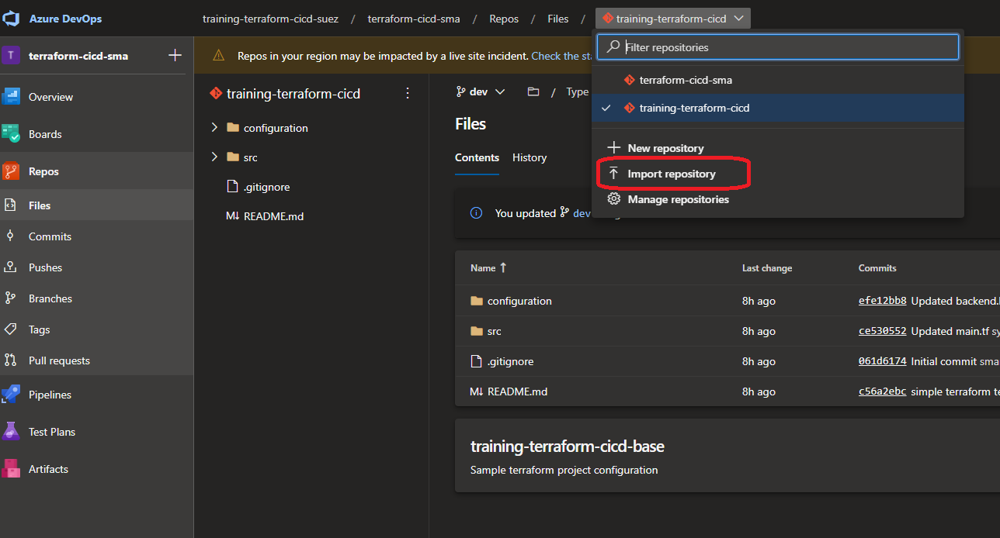
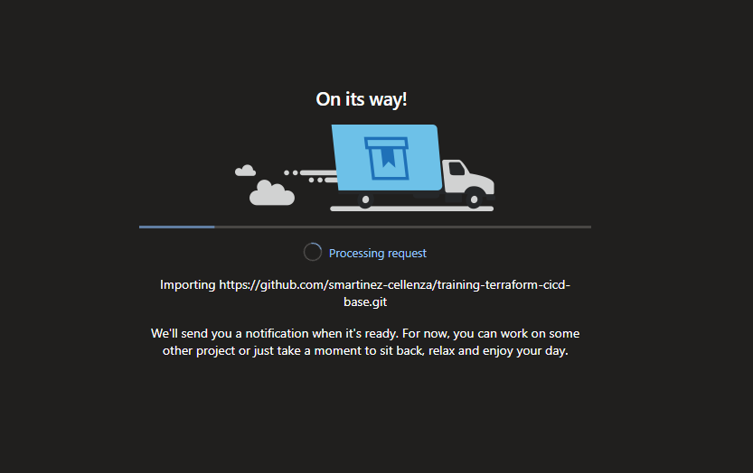
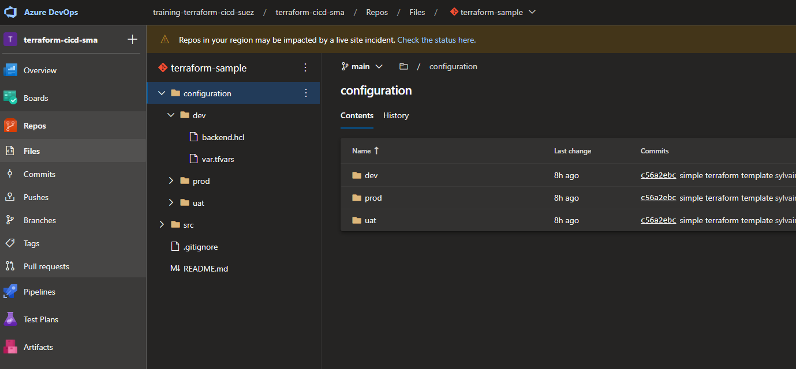
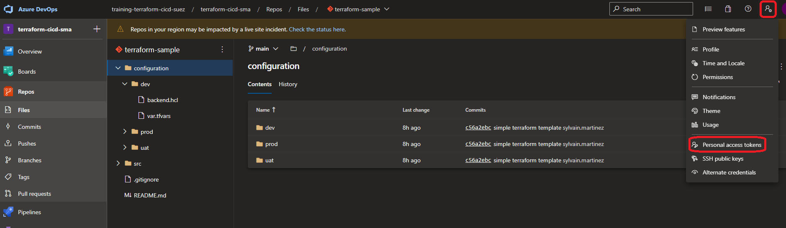
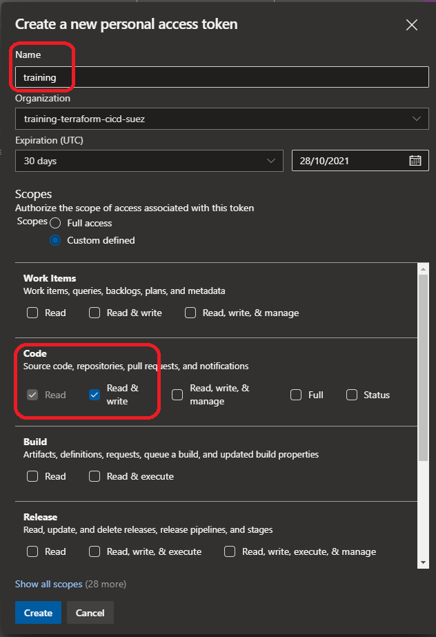
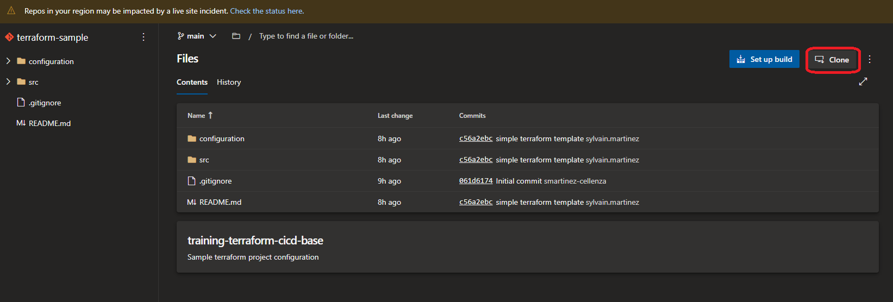

# Manage Terraform In Azure Repo Git

- [Manage Terraform In Azure Repo Git](#manage-terraform-in-azure-repo-git)
  - [Lab overview](#lab-overview)
  - [Objectives](#objectives)
  - [Instructions](#instructions)
    - [Before you start](#before-you-start)
    - [Exercise 1: Import a Git Repository](#exercise-1-import-a-git-repository)
    - [Exercise 2: Create a branch](#exercise-2-create-a-branch)
      - [Generate a PAT (Personal Access Token)](#generate-a-pat-personal-access-token)
      - [Clone Repository and create branch](#clone-repository-and-create-branch)
    - [Exercise 3: Protect main branch](#exercise-3-protect-main-branch)

## Lab overview

In this lab, you will learn how to use Source Control for Terraform templates.

## Objectives

After you complete this lab, you will be able to:

-   Create an Azure Git repository
-   Use Source Control for Terraform templates.

## Instructions

### Before you start

- Check your access to the Azure Subscription and Resource Group provided for this training.
- Check your access to the Azure DevOps Organization and project provided for this training.
- Using the Azure portal, create a Storage Account with a `tfstates` container. We will use that container as backend for the the tfstate file.


### Exercise 1: Import a Git Repository

We are going to use an existing repository and import it in Azure DevOps.

In Azure DevOps portal, go to the *Repos* blade:



Under the Repository dropdown list select Import Repository:



In the Import blade:

- Leave the Repository type to Git
- For the the Clone URL, use **https://github.com/smartinez-cellenza/training-terraform-cicd-base.git**
- Name your repository **terraform-sample**

The import will start and create a new Azure DevOps Git repository.



The repository is imported and ready to use.



### Exercise 2: Create a branch

In this exercise, we are going to create a `dev` branch.  
If this exercise is shared between several people, and you all want to use the same `dev` branch, you might 
- wait for one persone to create the `dev` branch, 
- wait for the branch to be published to remote, 
- use it next on your local repo.  

Or you can also create several different (personal) `dev` branches, naming them accordingly (e.g. `dev-myName`).

#### Generate a PAT (Personal Access Token)

In Azure DevOps portal, generate a new Personal Access Token:



Click on *New Token*



- Name : training
- Scope : Code -> Read & write

Click on Create and **copy** the generated Token! (will not longer be available after  you close the window)

> We're going to use this token to clone the repository.

#### Clone Repository and create branch

Get the clone URL of your repository:



In Azure portal, open a Cloud Shell session, and run the following command to clone the repository

```powershell
git clone repository_url_from_previous_step
```

When prompted, paste the Personal Access Token.  
Go to the cloned Repository folder:

```powershell
cd ./terraform-sample/
```

Create a new local branch, nammed `dev` (or `dev-myName`):

```powershell
git checkout -b dev
```

In the configuration folder, update the `backend.hcl` file for each environment: update `resource_group_name` and `storage_account_name` to match the Storage Account you created earlier.  

Add all the updated files for the next commit:

```powershell
git status
git add .
```

Create a new commit:

```powershell
git commit -m "update backend configuration"
```

Push this branch:

```powershell
git push --set-upstream origin dev
```

When prompted, paste the Personal Access Token.  

When the `dev` branch has been pushed to remote, it can be locally retrieved by someone else.  
We first fetch remote contents, and next move to the branch:

```powershell
git branch -a  # <-- list all local + remote branches
git fetch      # <-- retrieve remote contents
git branch -a  # <-- dev branch is now visible
git checkout dev  # <-- move to dev branch
```

### Exercise 3: Protect main branch

> To set branch policies, you must be a member of the *Project Administrators* security group or have repository-level *Edit policies* permissions.

Go to the project settings -> Repositories.  
Select the *terraform-sample* project.  
Select the *Policies* blade.  
Under *Branch Policies*, select the `main` branch.  

Activate the option **Require a minimum number of reviewers**
- set the *Minimum number of reviewvers* to 1 
- and *Allow requestors to approve their own changes*.  

> No *apply* is needed, settings are directly taken into account.

This will prevent direct commit to the main branch, and only allow Pull Request.  

> This configuration is not suitable for a real world project, but it allows you to complete pull request for this lab.
