# Create a build pipeline

- [Create a build pipeline](#create-a-build-pipeline)
  - [Lab overview](#lab-overview)
  - [Objectives](#objectives)
  - [Instructions](#instructions)
    - [Before you start](#before-you-start)
    - [Exercise 1: Create a PR pipeline](#exercise-1-create-a-pr-pipeline)
    - [Exercise 2: Add this pipeline to the policy rules on dev branch](#exercise-2-add-this-pipeline-to-the-policy-rules-on-dev-branch)
    - [Exercise 3: Create a pull request from feat/updateconf to dev](#exercise-3-create-a-pull-request-from-featupdateconf-to-dev)
    - [Exercice 4: Create library for `Dev` environment](#exercice-4-create-library-for-dev-environment)
    - [Exercice 5: Add a step for Terraform plan on PR to dev](#exercice-5-add-a-step-for-terraform-plan-on-pr-to-dev)
    - [Exercice 6: Deploy to Dev environment](#exercice-6-deploy-to-dev-environment)
    - [Exercise 7: Generate a build artifact when changes are merged onto the main branch](#exercise-7-generate-a-build-artifact-when-changes-are-merged-onto-the-main-branch)
    - [Exercise 8: Create a pull request from dev to main](#exercise-8-create-a-pull-request-from-dev-to-main)

## Lab overview

In this lab, you will learn how to use Build pipeline.

## Objectives

After you complete this lab, you will be able to:

-   Create a build pipeline using yaml,
-   Trigger this pipeline when a Pull Request is created and set it mandatory,
-   Deploy to the `dev` environment.

## Instructions

### Before you start

- Check your access to the **Azure Subscription** and **Resource Group** provided for this training.
- Check your access to the **Azure DevOps Organization** and **project** provided for this training.
- The Azure DevOps project gets
  - branch configuration according to the lab *1-Manage Terraform In Azure Repo Git*,
  - Azure Resource Manager Service Connection configured as
    - name = *ARM Service Connection DEV*
    - targetting Azure training subscription
    - secret set as defined in associated Entra Id Service Principal
    - SP having Contributor role onto Azure training subscription.

### Exercise 1: Create a PR pipeline

In this exercise, we will create a validation pipeline that will check the formating style of Terraform templates.

Navigate to your *terraform-sample* repository in Azure DevOps portal.  
Select the *feat/updateconf* branch.  
Create a new folder, and a new file inside it:
- New folder name: pipelines
- New file name: PR.yml

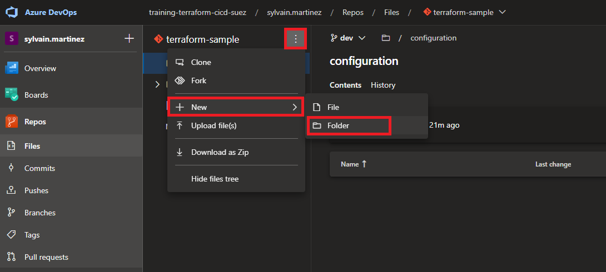

Copy the following code in the editor:

```yaml
trigger: none

jobs:
- job: Linter
  displayName: Linter
  pool:
    vmImage: ubuntu-20.04
  steps:
  - checkout: self
  - task: PowerShell@2
    inputs:
      targetType: 'inline'
      script: |
        cd ./src/terraform
        terraform fmt -recursive -check -diff
```

Commit this file.  

> Have a look to the different sections in this yaml file.

Go to the Pipelines blade in Azure DevOps and create a new pipeline:

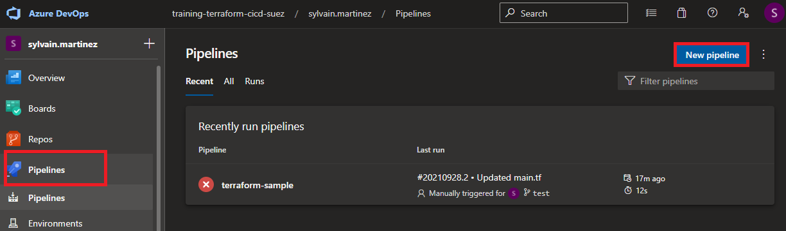

For *Where is your source code* step, select **Azure Repo Git**.  
For *Select a repository* step, select **terraform-sample**.  
For *Configure your pipeline* step, select **Existing Azure Pipelines YAML file**.  
For *Select an existing YAML file*
- select the `feat/updateconf` branch
- fill the path: **/pipelines/PR.yml**

Click on *Run* to execute the pipeline.

> Check the pipeline execution.  
> This pipeline uses `terraform fmt` to lint terraform source code. If you have errors, fix them and run the pipeline again.

Select the pipeline in the pipeline blade, and rename it to `PR`.

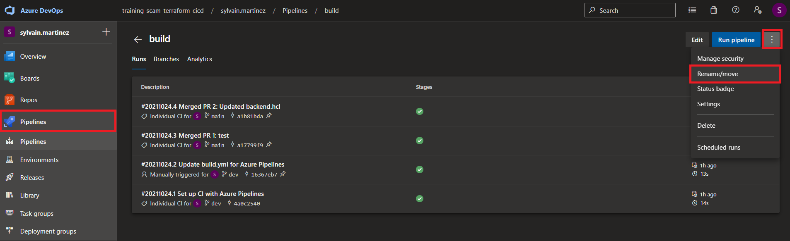

### Exercise 2: Add this pipeline to the policy rules on dev branch

Go to the project settings -> Repositories.  
Select the *terraform-sample* project.  
Select the *Policies* blade.  
Under *Branch Policies*, select the `dev` branch.  

Add a new **Build validation** rule:

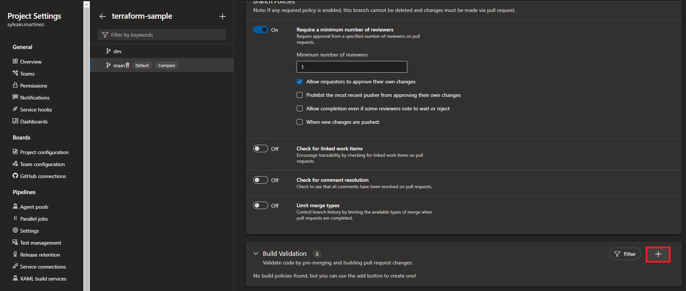

Leave the default options and **Save**.

### Exercise 3: Create a pull request from feat/updateconf to dev

In the Azure Repo blade, select the *terraform-sample* repo.  
In the repository blade sub-menu, select *Pull Requests*.  
Create a new Pull request.  
In the branch selection, select from `feat/updateconf` into `dev` and set its title to *update config*.
You can also add a *Description*.  
Click on **Create** at the bottom of the page. 

> Notice that the build validation is triggered.  
> Notice also the *At least 1 reviewer must approve* note: you cannot complete the Pull Request until someone has validated it.  

Approve and complete the Pull Request. You can leave default value for merge type.  

### Exercice 4: Create library for `Dev` environment

In this exercice we will create a library for the `dev` environment.

> A library can be used to store variables and secrets for an environment:
> - an environment configuration can be spread to multiple libraries. 
> - but a library should be linked to only one environnement for better segregation.  

In the pipeline blade, Select Library and add a variable group:

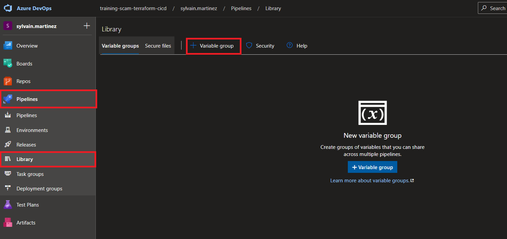

*Properties* > *Variable group name* = **dev**

From the *Variables* section, add the following item:

- **admin_account_password**: The Admin Account password for the database to be created. Must be Azure compliant (P@ssword01! is fine in case no inspiration...). Click on the locker to set the **admin_account_password** as secret.

Save your modifications.  

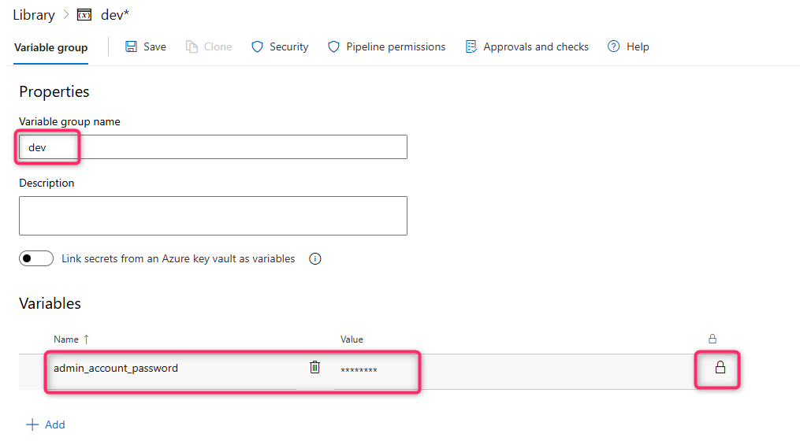

### Exercice 5: Add a step for Terraform plan on PR to dev

Remember we have setup a build validation policy rule on `dev` branch.  
The associated `PR.yaml` workflow is running a `terraform fmt` command.  
We now want to execute a Terraform init + plan on Pull Requests to `dev`.  

Create a new branch using the Azure DevOps portal.

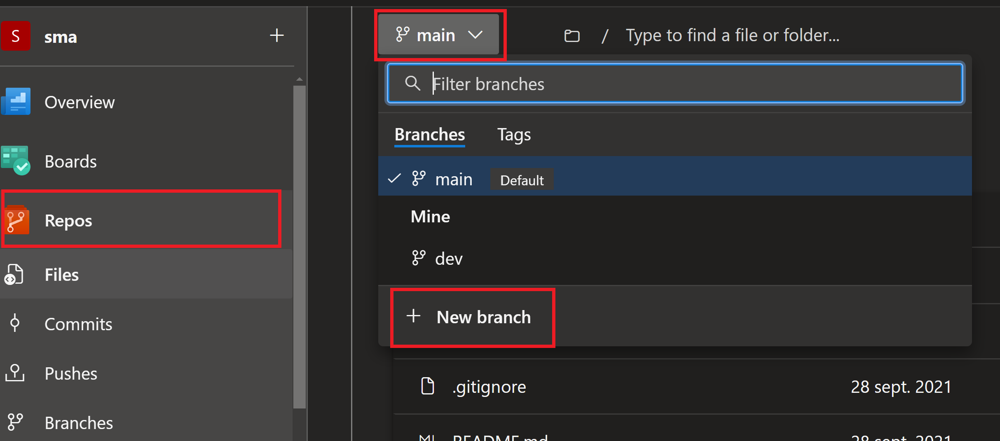

Select `dev` in the *based on* field, and name this branch *`feat/planpr`.  

From the portal editor, update the content of the `PR.yml` file using the following yaml:

```yaml
trigger: none

stages:
- stage: Linter
  displayName: Linter
  jobs:
  - job: Linter
    displayName: Linter
    pool:
      vmImage: ubuntu-20.04
    steps:
    - checkout: self
    - task: PowerShell@2
      inputs:
        targetType: 'inline'
        script: |
          cd ./src/terraform
          terraform fmt -recursive -check -diff

- stage: terraform_plan
  displayName: Terraform plan on Dev Environment
  dependsOn: Linter
  jobs :
  - job: terraform_plan_dev
    displayName: Run terraform plan on Dev environment
    variables:
    - group:  dev
    steps:
    - checkout: self

    - task: AzureCLI@2
      env:
        TF_VAR_admin_account_password : $(admin_account_password)
      displayName: Run terraform plan on Dev environment
      inputs:
        azureSubscription: ARM Service Connection DEV
        scriptType: 'pscore'
        scriptLocation: 'inlineScript'
        addSpnToEnvironment: true
        inlineScript: |
            cd ./src/terraform
            $env:ARM_CLIENT_ID=$env:servicePrincipalId
            $env:ARM_CLIENT_SECRET=$env:servicePrincipalKey
            $env:ARM_TENANT_ID=$env:tenantId
            terraform init -upgrade -backend-config='../../configuration/dev/backend.hcl'
            terraform plan -var-file='../../configuration/dev/var.tfvars' -input=false
```

> Have a look to the different sections of this pipeline.

Commit this file to the `feat/planpr` branch, and create a new Pull Request from `feat/planpr` to `dev` to publish your changes.

> The **PR** build validation is triggered.

Click on *PR Build in progress* to monitor the build process.  
The workflwo is stopped in the *Terraform plan on Dev Environment* step, requesting for resources authorization.  

> You must grant authorization for the PR pipeline to access Azure DevOps resources, here the Service Connection.  
> This only happens at first pipeline run (for every new resource to access).  

Click on *View* and grant the required permissions clicking on *View* then *Permit* for Service Connection.

Once the stage is executed, you can see the generated plan in the pipeline logs.  
Do not yet complete the Pull Request! We will continue using it for next steps...

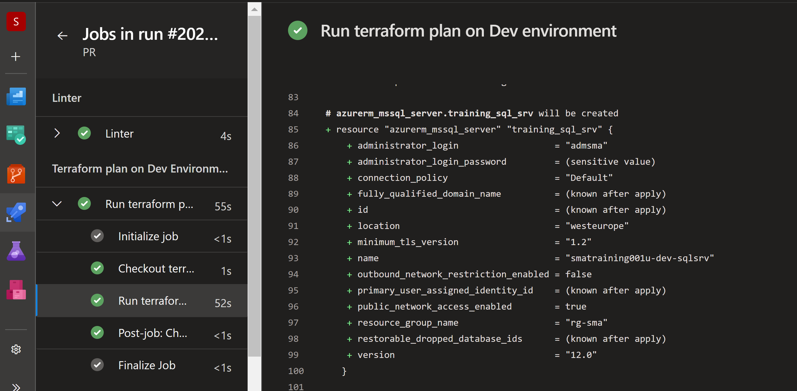

### Exercice 6: Deploy to Dev environment

We will now add a new pipeline to deploy the Terraform resources onto Dev environment at the time the Pull Request is merged into the *dev* branch.

From the Azure DevOps portal, add a new file in the pipelines folder to `feat/planpr` branch.  
Name it `latest.yaml`, and copy the below code:

```yaml
trigger:
  branches:
    include:
    - dev

stages:
- stage: terraform_apply
  displayName: Terraform Apply on Dev Environment
  jobs :
  - job: terraform_apply_dev
    displayName: Run terraform apply on Dev environment
    variables:
    - group:  dev
    steps:
    - checkout: self

    - task: AzureCLI@2
      env:
        TF_VAR_admin_account_password : $(admin_account_password)
      displayName: Run terraform apply on Dev environment
      inputs:
        azureSubscription: ARM Service Connection DEV
        scriptType: 'pscore'
        scriptLocation: 'inlineScript'
        addSpnToEnvironment: true
        inlineScript: |
            cd ./src/terraform
            $env:ARM_CLIENT_ID=$env:servicePrincipalId
            $env:ARM_CLIENT_SECRET=$env:servicePrincipalKey
            $env:ARM_TENANT_ID=$env:tenantId
            terraform init -upgrade -backend-config='../../configuration/dev/backend.hcl'
            terraform apply -var-file='../../configuration/dev/var.tfvars' -input=false -auto-approve
```

Commit the new file.

> Adding this file will update the running Pull Request, and a new PR build validation is executed.

Create a new Pipeline in Azure DevOps based on `latest.yaml` (refer to the seps done in [Exercise 1: Create a PR pipeline](#exercise-1-create-a-pr-pipeline)).

!! Do not yet run this pipeline, only save it.

Rename the pipeline to `latest`.

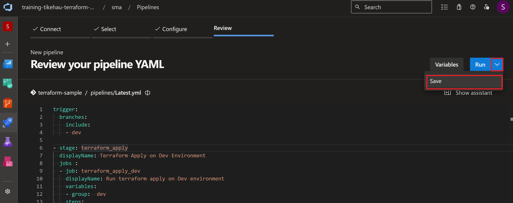

You can now complete and merge the opened Pull Request.  
Once it's merged, the `latest` pipeline is triggered.  

> As it's a new pipeline, you'll also have to grant required permission for the pipeline to use the Azure DevOps resources. We are now dealing with two resources, the Service Connection and the library (for the SQL server admin password value).  
> Go to the pipeline blade, browse to the running latest workflow, and click on *Permit* for the two resources.  

Once the pipeline is executed, check the created resources in the Azure Portal

### Exercise 7: Generate a build artifact when changes are merged onto the main branch

We now have 
- a pipeline for `terraform fmt` and `terraform init + plan` executed when creating a PR to `dev`,
- a pipeline for terrafrom apply executed when merging to `dev`.

In this exercise we will add a third pipeline that will generated a build artifact (the terraform files defining the infrastructure) when new code is merged onto the main branch.  

Navigate to your *terraform-sample* repository from Azure DevOps portal.  
Create a new branch based on `dev` and name it `feat/buildartifact`.  
Create a new file named `build.yml` under the *pipelines* folder and copy the code below:

```yaml
trigger:
  branches:
    include:
    - main

jobs:
- job: Artifact
  displayName: Upload artifact
  pool:
    vmImage: ubuntu-20.04
  steps:
  - checkout: self
  - task: PowerShell@2
    inputs:
      targetType: 'inline'
      script: |
        Copy-Item -Path ./src -Destination $(Build.ArtifactStagingDirectory)/terraform -Recurse
        Copy-Item -Path ./configuration -Destination $(Build.ArtifactStagingDirectory)/terraform -Recurse
  - task: PublishBuildArtifacts@1
    inputs:
      PathtoPublish: '$(Build.ArtifactStagingDirectory)/terraform'
      ArtifactName: 'terraform'
      publishLocation: 'Container'
```
Commit this file.  

> This pipeline creates an artifact containing both *src* and *configuration* folders.  
> These files are required to perform a deployment on an environment.

Go to the *Pipelines* blade in Azure DevOps and create a new pipeline (refer to [Exercise 1: Create a PR pipeline](#exercise-1-create-a-pr-pipeline)):


Click on *Save* (do not run the pipeline right now).  
Rename this pipeline as `build`.  
Create a Pull Request and merge this branch in the `dev` branch.  

### Exercise 8: Create a pull request from dev to main

In the Azure Repo blade, select the *terraform-sample* repo.  
In the repository blade sub-menu, select *Pull Requests*.  
Create a new Pull request from `dev` to `main`.  
Enter values for *Title* and *Description*.  

Merge the Pull Rerquest.  
!! When merging the Pull Request, ensure that *Delete dev after merging* is **not** checked.  
This should not be the case as `dev`is protected with PR policies...  

> Notice that the build pipeline has been triggered and artifact is published.  

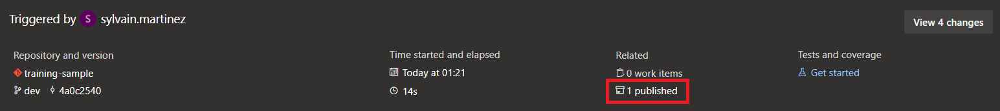

> Notice the content of the generated artifact:

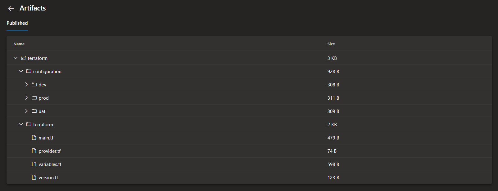
