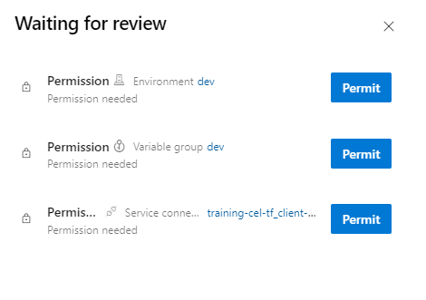
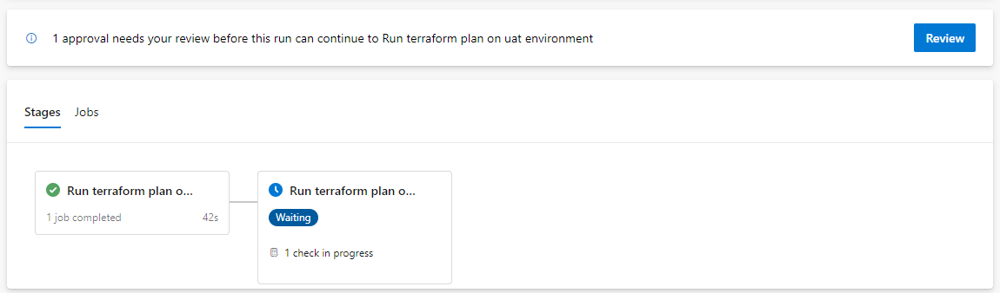

# Create a release pipeline

- [Create a release pipeline](#create-a-release-pipeline)
  - [Lab overview](#lab-overview)
  - [Objectives](#objectives)
  - [Instructions](#instructions)
    - [Before you start](#before-you-start)
    - [Exercise 1: Create Environments](#exercise-1-create-environments)
    - [Exercise 2: Set approbation](#exercise-2-set-approbation)
    - [Exercise 3: Create Libraries](#exercise-3-create-libraries)
    - [Exercise 4: Create Release Pipeline for dev environment](#exercise-4-create-release-pipeline-for-dev-environment)
    - [Exercise 4: Create Release Pipeline for uat environment](#exercise-4-create-release-pipeline-for-uat-environment)

## Lab overview

In this lab, you will learn how to use release pipeline.

## Objectives

After you complete this lab, you will be able to:

-   Create a release pipeline using yaml,
-   Deploy Terraform template using CI/CD.

## Instructions

### Before you start

- Check your access to the Azure Subscription and Resource Group provided for this training.
- Check your access to the Azure DevOps Organization and project provided for this training.
- Project has branch configuration according to the lab *1-Manage Terraform In Azure Repo Git* and backend configuration is done to match your Storage Account.

### Exercise 1: Create Environments

In this exercise, we will create the 3 environments (in Azure DevOps) to match the 3 configuration we have.  
In Azure DevOps portal, go the *Pipelines* blade, and select *Environments*.  
Click on *Create environment*.


Enter the *Name* and *Description* for the environment to create (start with `dev`):

- **Name**: dev *(keep it lowercase)*
- **Description**: Dev environment
- Keep the *None* default selection for *Resource*.

Repeat this step for the `uat` and `prod` environments.  

### Exercise 2: Set approbation

In this exercise we will configure an approval step before deploying to `uat` and `prod` environments.  
The workflow is:
- deploy to `dev` without approval,
- requires a manual approbation for the other two environments.  

In Azure DevOps portal, go to *Pipelines* blade, and select *Environments*.  
Select the `uat` environment.  
In the options menu, select *Approval and checks*:


Select *Aprovals*:


Add your name in the *Approvers* list, give *Instructions* details, and click on *Create*.  

> Have a look to the other available checks, e.g. based on Branch or Business Hours...

Repeat this step for the `prod` environment.

### Exercise 3: Create Libraries

In this exercise we will create a library for storing data for each of the environments.  
A library can be used to store variables and secrets for an environment.  

> An environment configuration can be spread to multiple libraries.  
> All of these libraries should follow the environment segregation principle.

In the *Pipelines* blade, Select *Library* and add a variable group:


Set the *Variable group name* to `dev`.  
Under *Variables*, add 3 items:

- `ARM_ACCESS_KEY`: One of the *tfstate* Storage Account Access keys. Since we will use a Service Principal to authenticate to Azure, this information is required. Get the key from Azure portal.
- `ARM_SUBSCRIPTION_ID`: The subscription Id where resources must be deployed. Use the training subscription Id. You can get it from the Azure portal.
- `admin_account_password`: The Admin Account password for the database to be created. Must be Azure compliant (if you're not inspired, P@ssword01! is fine).  

For `ARM_ACCESS_KEY` and `admin_account_password` variables, set them as secret!


Repeat the same operation for `uat` and `prod` environments.  
In current lab scope, `ARM_ACCESS_KEY` and `ARM_SUBSCRIPTION_ID` won't change as we always target the same training subscription...

### Exercise 4: Create Release Pipeline for dev environment

In this exercise, we will create the Release pipeline for DEV environment.  
It will use
- The artefact produced by the build pipeline (latest build from any branch),
- Data from the dedicated *Library* created in previous step,
- The dedicated *Environment* created in previous step.

You must first update the three `configuration/*/var.tfvars` file to add your specific data.  

A Service Connection has been created and shared in your Azure DevOps project. It contains the information on the Service Principal.  

Select your *terraform-sample* in Azure DevOps portal.  
Select the `dev` branch.  
Create a new file under the *pipelines* folder:
- New file name: release_dev.yml

Copy the following code in the editor:

```yaml
trigger: none

pool:
  vmImage: ubuntu-latest

resources:
 pipelines:
   - pipeline: build
     source: build

jobs :
  - deployment: deploy_dev
    displayName: Deploy Dev Environment
    environment: dev
    variables:
    - group: dev
    strategy:
     runOnce:
       deploy:
         steps:
           - task: AzureCLI@2
             env:
               TF_VAR_admin_account_password: $(admin_account_password)
             displayName: Deploy Dev Environment
             inputs:
              azureSubscription: 'Terraform Service Principal'
              scriptType: 'pscore'
              scriptLocation: 'inlineScript'
              addSpnToEnvironment: true
              inlineScript: |
                cd $(PIPELINE.WORKSPACE)/build/terraform/terraform
                $env:ARM_CLIENT_ID=$env:servicePrincipalId
                $env:ARM_CLIENT_SECRET=$env:servicePrincipalKey
                $env:ARM_TENANT_ID=$env:tenantId
                terraform init -backend-config='../configuration/dev/backend.hcl'
                terraform apply -var-file='../configuration/dev/var.tfvars' -input=false -auto-approve
```

Set the name of the Service Connection in `azureSubscription` attribute.  
Commit this file.  

> Have a look to the different sections.  
> Check the deployment step.  

Go to the *Pipelines* blade in Azure DevOps and create a new pipeline:


For *Where is your source code* step, select **Azure Repo Git**.  
For *Select a repository* step, select **terraform-sample**.  
For *Configure your pipeline* step, select **Existing Azure Pipelines YAML file**.  
For *Select an existing YAML file*
- select the `dev` branch
- fill the path: **/pipelines/release_dev.yml**

Click on *Run* to execute the pipeline.  
In the *Pipelines* blade, check the pipeline run.  

> Pipeline needs permission to access 3 resources before this run can continue...  

Because we didn't grant access permission to all pipelines for the Service Connection, permission is required at first pipeline run.  



At run time, pipelines uses artifact published by latest `build` pipeline (Terraform templates), and uses it to deploy the Azure resources.  
When pipeline run is done, go to Azure portal and check resources creation in your Resource Group.  

Select the release pipeline in the *Pipelines* blade, and rename it to `release_dev`.


### Exercise 4: Create Release Pipeline for uat environment

In the exercise, we will create the Release pipeline for UAT environment.  
It will use
- The artefact produced by the build pipeline (latest build from any branch),
- Data from the dedicated *Library* created in previous step,
- The dedicated *Environment* created in previous step.

A Service Connection has been created and shared in your project. It contains the information on the Service Principal.  

Select your *terraform-sample* in Azure DevOps portal.  
Select the `dev` branch.  
Create a new file under the *pipelines* folder:
- New file name: release_uat.yml

Copy the following code in the editor

```yaml
trigger: none

pool:
  vmImage: ubuntu-latest

resources:
 pipelines:
   - pipeline: build
     source: build

stages:
- stage: plan_uat
  displayName: Run terraform plan on uat environment
  jobs :
    - job: plan_uat
      displayName: Run terraform plan on uat environment
      variables:
      - group:  uat
      steps:
      - checkout: self
      - download: build
      - task: AzureCLI@2
        env:
          TF_VAR_admin_account_password: $(admin_account_password)
        displayName: Run terraform plan on uat environment
        inputs:
          azureSubscription: 'Terraform Service Principal'
          scriptType: 'pscore'
          scriptLocation: 'inlineScript'
          addSpnToEnvironment: true
          inlineScript: |
            cd $(PIPELINE.WORKSPACE)/build/terraform/terraform
            $env:ARM_CLIENT_ID=$env:servicePrincipalId
            $env:ARM_CLIENT_SECRET=$env:servicePrincipalKey
            $env:ARM_TENANT_ID=$env:tenantId
            terraform init -backend-config='../configuration/uat/backend.hcl'
            terraform plan -var-file='../configuration/uat/var.tfvars' -input=false

- stage: apply_uat
  displayName: Run terraform plan on uat environment
  dependsOn: plan_uat
  jobs :
    - deployment: deploy_uat
      displayName: Deploy Uat Environment      
      environment: uat
      variables:
      - group: uat
      strategy:
        runOnce:
          deploy:
            steps:
              - task: AzureCLI@2
                env:
                  TF_VAR_admin_account_password: $(admin_account_password)
                displayName: Deploy Uat Environment
                inputs:
                  azureSubscription: 'Terraform Service Principal'
                  scriptType: 'pscore'
                  scriptLocation: 'inlineScript'
                  addSpnToEnvironment: true
                  inlineScript: |
                    cd $(PIPELINE.WORKSPACE)/build/terraform/terraform
                    $env:ARM_CLIENT_ID=$env:servicePrincipalId
                    $env:ARM_CLIENT_SECRET=$env:servicePrincipalKey
                    $env:ARM_TENANT_ID=$env:tenantId
                    terraform init -backend-config='../configuration/uat/backend.hcl'
                    terraform apply -var-file='../configuration/uat/var.tfvars' -input=false -auto-approve

```

Set the name of the Service Connection in `azureSubscription` attribute.  
Commit this file.  

> Have a look to the different sections.  
> Check the deployment step.  

Go to the *Pipelines* blade in Azure DevOps and create a new pipeline:


For *Where is your source code* step, select **Azure Repo Git**.  
For *Select a repository* step, select **terraform-sample**.  
For *Configure your pipeline* step, select **Existing Azure Pipelines YAML file**.  
For *Select an existing YAML file*
- select the `dev` branch
- fill the path: **/pipelines/release_uat.yml**

Click on *Run* to execute the pipeline.  
In the *Pipelines* blade, check the pipeline run.  

> Pipeline needs permission to access 3 resources before this run can continue...  

Because we didn't grant access permission to all pipelines for the Service Connection, permission is required at first pipeline run.  


> Notice the required approbation step after `terraform plan`!  
> At this time, you can open the logs, and check the Terraform plan before approving deployment to the environment.  



At run time, pipelines uses artifact published by latest `build` pipeline (Terraform templates), and uses it to deploy the Azure resources.  
When pipeline run is done, go to Azure portal and check resources creation in your Resource Group.   

Select the release pipeline in the *Pipelines* blade, and rename it to `release_uat`.


