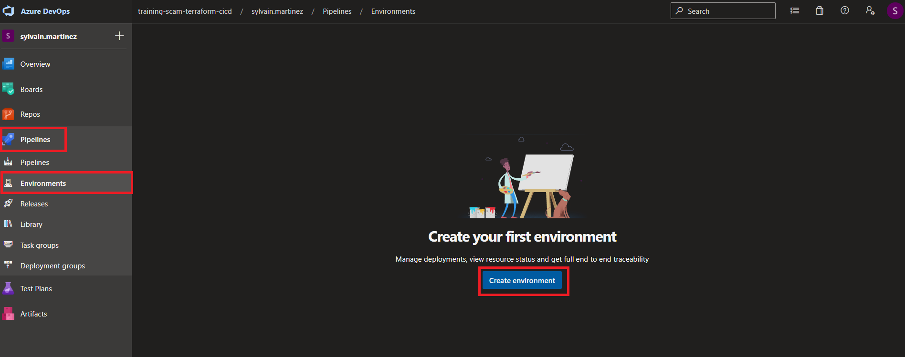
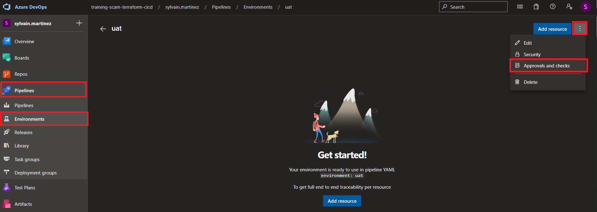
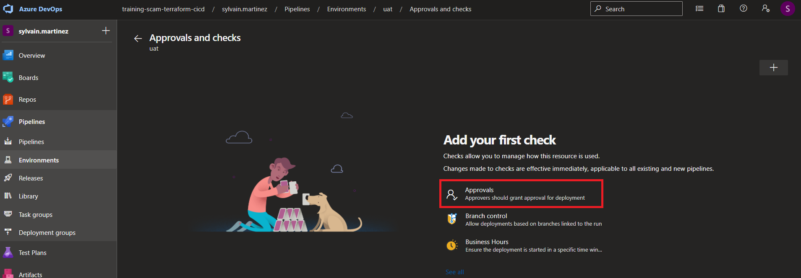
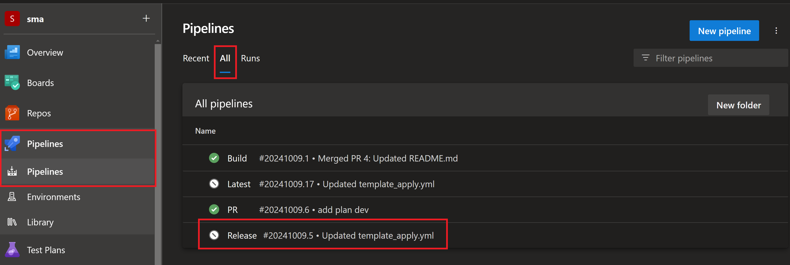
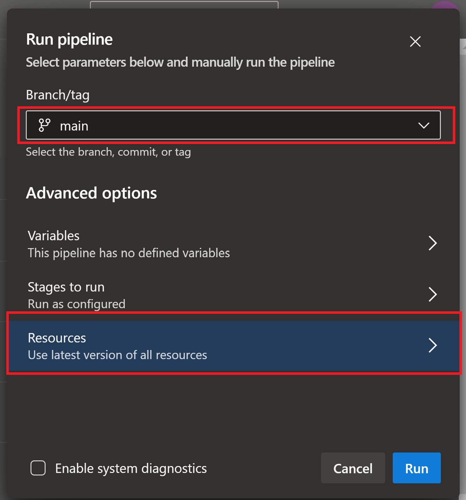

# Create a release pipeline

- [Create a release pipeline](#create-a-release-pipeline)
  - [Lab overview](#lab-overview)
  - [Objectives](#objectives)
  - [Instructions](#instructions)
    - [Before you start](#before-you-start)
    - [Exercise 1: Create Environments](#exercise-1-create-environments)
    - [Exercise 2: Set approbation](#exercise-2-set-approbation)
    - [Exercise 3: Create Libraries](#exercise-3-create-libraries)
    - [Exercise 4: Create Release Pipeline for dev environment](#exercise-4-create-release-pipeline-for-dev-environment)
    - [Exercise 5: Trigger the release pipeline](#exercise-5-trigger-the-release-pipeline)

## Lab overview

In this lab, you will learn how to use a release pipeline.

## Objectives

After you complete this lab, you will be able to:

-   Create a release pipeline using yaml,
-   Deploy Terraform template using CI/CD.

## Instructions

### Before you start

- Check your access to the **Azure Subscription** and **Resource Group** provided for this training.
- Check your access to the **Azure DevOps Organization** and **project** provided for this training.
- The Azure DevOps project gets
  - branch configuration according to the lab *1-Manage Terraform In Azure Repo Git*,
  - Azure Resource Manager Service Connections configured as
    - name = *ARM Service Connection {env}* with env == DEV, UAT and PROD
    - targetting Azure training subscription
    - secret set as defined in associated Entra Id Service Principal
    - SP having Contributor role onto Azure training subscription.
  
### Exercise 1: Create Environments

In this exercise, we will create two Azure DevOps environments for UAT and PROD.    
In Azure DevOps portal, go the *Pipelines* blade, and select *Environments*.  
Click on *Create environment*.



Enter the *Name* and *Description* for the environment to create (start with `uat`):

- **Name**: uat *(keep it lowercase)*
- **Description**: UAT environment
- Keep the *None* default selection for *Resource*.

Repeat this step for the `prod` environment.  

### Exercise 2: Set approbation

In this exercise we will configure an approval step before deploying to `uat` and `prod` environments.  
The complete workflow will look like:
- deploy to `dev` without approval,
- require a manual approbation for the other two environments (should only be given when the Terraform plan from `dev` is reviewed and validated).  

In Azure DevOps portal, go to *Pipelines* blade, and select *Environments*.  
Select the `uat` environment.  
In the options menu, select *Approval and checks*:



Select *Aprovals*:



Add your name in the *Approvers* list, give *Instructions* details, and click on *Create*.  

> Have a look to the other available checks, e.g. based on Branch or Business Hours...

Repeat this step for the `prod` environment.

### Exercise 3: Create Libraries

In this exercise we will create a library for storing data for each of the environments.  
A library can be used to store variables and secrets for an environment.  

> An environment configuration can be spread to multiple libraries.  
> All of these libraries should follow the environment segregation principle.

We already have a `dev` variable group from *2-Build pipeline* previous lab.  
We will add two new variable groups for `uat` and `prod`.  

In the *Pipelines* blade, Select *Library* and ask for a new `uat` variable group.  
From the *Variables* section, add the following item:

- **admin_account_password**: The Admin Account password for the database to be created. Must be Azure compliant (P@ssword01! is fine in case no inspiration...). Click on the locker to set the **admin_account_password** as secret.

Save your modifications.  


Repeat the same operation (create variable group and add 1 item) for `prod` environment.  

### Exercise 4: Create Release Pipeline for dev environment

In this exercise, we will create the Release pipeline for DEV environment.  
It will use
- The artefact produced by the build pipeline (latest build from any branch),
- Data from the dedicated *Library* created in previous step,
- The dedicated *Environment* created in previous step.

Select your *terraform-sample* in Azure DevOps portal.  
Create a new `feat/release` branch from `dev`.  
Create a new file under the *pipelines* folder and name it `template_plan.yaml`.

Copy the following code in the editor:

```yaml
parameters:
- name: stageName
- name: environment
- name: dependsOn
  type: object
  default: []

stages:
- stage: ${{ parameters.stageName }}
  displayName: Run terraform plan on ${{ parameters.environment }} environment
  dependsOn: ${{ parameters.dependsOn }}
  pool:
    vmImage: ubuntu-22.04
  jobs :
  - job: terraform_plan_${{ parameters.environment }}
    displayName: Run terraform plan on ${{ parameters.environment }} environment
    variables:
    - group:  ${{ parameters.environment }}
    steps:
    - download: build
    - task: AzureCLI@2
      env:
        TF_VAR_admin_account_password : $(admin_account_password)
      displayName: Run terraform plan on ${{ parameters.environment }} environment
      inputs:
        azureSubscription: 'ARM Service Connection ${{ upper(parameters.environment) }}'
        scriptType: 'pscore'
        scriptLocation: 'inlineScript'
        addSpnToEnvironment: true
        inlineScript: |
            cd $(PIPELINE.WORKSPACE)/Build/terraform/terraform
            $env:ARM_CLIENT_ID=$env:servicePrincipalId
            $env:ARM_CLIENT_SECRET=$env:servicePrincipalKey
            $env:ARM_TENANT_ID=$env:tenantId
            terraform init -backend-config='../configuration/${{ parameters.environment }}/backend.hcl'
            terraform plan -var-file='../configuration/${{ parameters.environment }}/var.tfvars' -input=false
```

> Have a look to the different sections.  
> Check the parameters and the syntax for interpolation.  
> This file is a template that we are going to use for both uat and prod environments.  

Commit this file.  

Create a new file in the `pipelines` folder and name it `template_apply.yaml`.  
Copy the following code in the editor:

```yaml
parameters:
- name: stageName
- name: environment
- name: dependsOn
  type: object
  default: []

stages:
- stage: ${{ parameters.stageName }}
  displayName: Run terraform apply on ${{ parameters.environment }} environment
  dependsOn: ${{ parameters.dependsOn }}
  pool:
    vmImage: ubuntu-22.04
  jobs :
  - deployment: terraform_apply_${{ parameters.environment }}
    displayName: Run terraform apply on ${{ parameters.environment }} environment
    environment: ${{ parameters.environment }}
    variables:
    - group:  ${{ parameters.environment }}
    strategy:
      runOnce:
        deploy:
          steps:
          - checkout: self
          - task: AzureCLI@2
            env:
              TF_VAR_admin_account_password : $(admin_account_password)
            displayName: Run terraform apply on ${{ parameters.environment }} environment
            inputs:
              azureSubscription: 'ARM Service Connection ${{ upper(parameters.environment) }}'
              scriptType: 'pscore'
              scriptLocation: 'inlineScript'
              addSpnToEnvironment: true
              inlineScript: |
                  cd $(PIPELINE.WORKSPACE)/Build/terraform/terraform
                  $env:ARM_CLIENT_ID=$env:servicePrincipalId
                  $env:ARM_CLIENT_SECRET=$env:servicePrincipalKey
                  $env:ARM_TENANT_ID=$env:tenantId
                  terraform init -backend-config='../configuration/${{ parameters.environment }}/backend.hcl'
                  terraform apply -var-file='../configuration/${{ parameters.environment }}/var.tfvars' -input=false -auto-approve
```

> This file is a template that we are going to use for both uat and prod environments.  

Create a new file in the `pipelines` folder and name it `release.yaml`.  
Copy the following code in the editor

```yml
trigger: none

resources:
  pipelines:
    - pipeline: Build
      source: Build

stages:
  - template: template_plan.yaml
    parameters:
      stageName: terraform_plan_uat
      environment: uat

  - template: template_apply.yaml
    parameters:
      stageName: terraform_apply_uat
      environment: uat
      dependsOn: ["terraform_plan_uat"]

  - template: template_plan.yaml
    parameters:
      stageName: terraform_plan_prod
      environment: prod
      dependsOn: ["terraform_apply_uat"]

  - template: template_apply.yaml
    parameters:
      stageName: terraform_apply_prod
      environment: prod
      dependsOn: ["terraform_plan_prod"]
```

> Notice the different sections.
> This workflow is the *main* one that we are going to use create our pipeline.  

Go to the *Pipelines* blade in Azure DevOps and create a new pipeline:


For *Where is your source code* step, select **Azure Repo Git**.  
For *Select a repository* step, select **terraform-sample**.  
For *Configure your pipeline* step, select **Existing Azure Pipelines YAML file**.  
For *Select an existing YAML file*
- select the `feat/realase` branch
- fill the path: **/pipelines/release.yaml**

Click on *Save* (do not yet execute the pipeline).  
Rename that pipeline to `release`.  


Merge the branch `feat/realase` into `dev` and next merge `dev` into `main`.

### Exercise 5: Trigger the release pipeline

In the exercise, we will trigger the release pipeline to deploy the resources in UAT and PROD.    
The pipeline will use
- The artefact produced by the build pipeline (latest build from any branch),
- Data from the dedicated *Library* created in previous steps,
- The dedicated *Environment* created in previous steps.

A Service Connection has been created and shared in your project for both UAT and PROD. It contains the information on the Service Principal.  

Navigate to your *terraform-sample* repository in Azure DevOps portal.  
In the pipeline blade, select the `release` pipeline.



Click on Run Pipeline.



> By selecting  the *Resources* blade, you are able to define the version of the artifact to deploy.  
> Default is to use the latest generated one.  

Click on *Run*.  
The pipeline execution starts.  
Grant the required authorizations to execute the terraform plan on uat environment stage.  
Once this stage is finished, grant the authorizations for the terraform apply on uat environment stage.  

> Even after the pipeline has been granted the authorizations, the stage will not execute.  
> It requires an approbation, configured in the Azure DevOps environment.  
> Approve the deployement.  

At run time, pipeline downloads artifact published by latest `build` pipeline, and uses it to deploy the Azure resources.  
When pipeline run is done, go to Azure portal and check resources creation in your Resource Group.   
